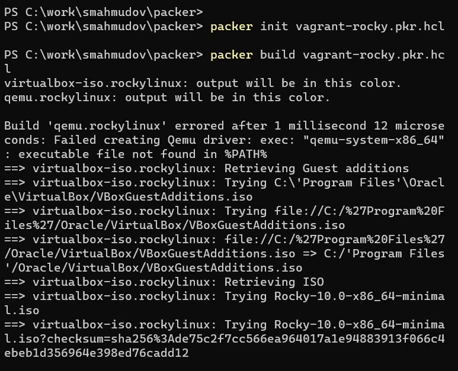
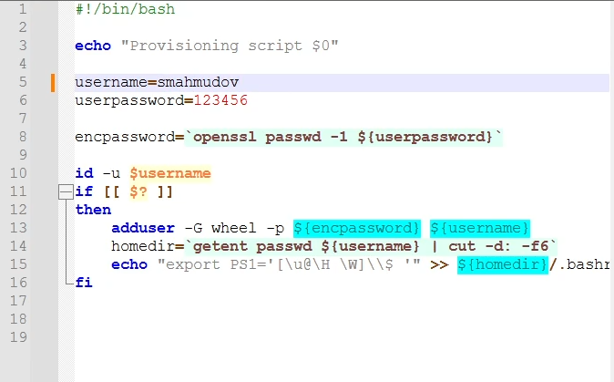
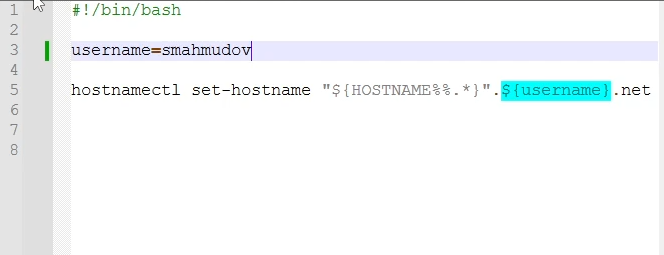
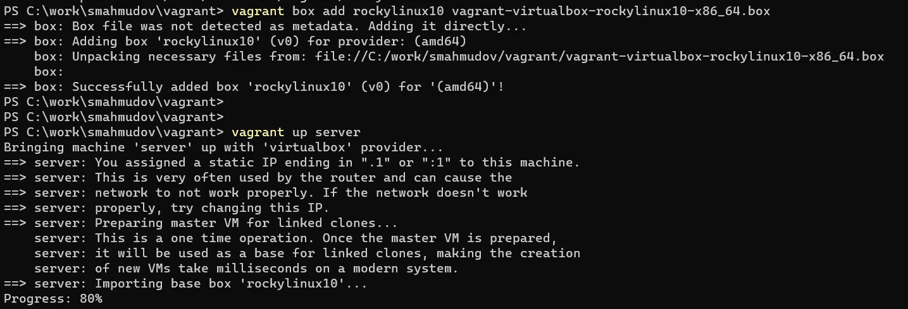
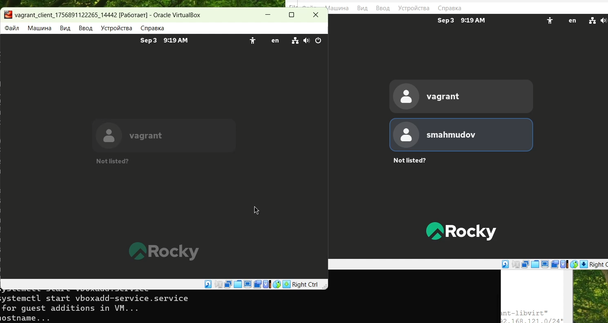
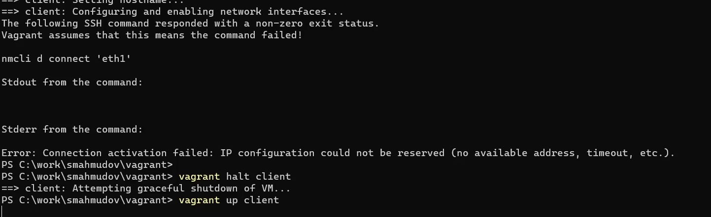
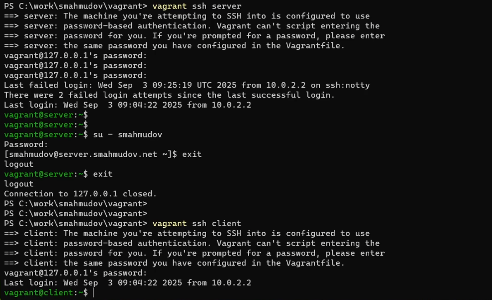

---
## Front matter
lang: ru-RU
title: Администрирование сетевых подсистем
subtitle: Подготовка лабораторного стенда с использованием Vagrant
author:
  - Суннатилло Махмудов
institute:
  - Российский университет дружбы народов, Москва, Россия
date: 4 сентября 2025

## i18n babel
babel-lang: russian
babel-otherlangs: english

## Formatting pdf
toc: false
toc-title: Содержание
slide_level: 2
aspectratio: 169
section-titles: true
theme: metropolis
header-includes:
 - \metroset{progressbar=frametitle,sectionpage=progressbar,numbering=fraction}
---

# Цели и задачи работы

## Цель лабораторной работы

Приобретение практических навыков установки Rocky Linux 10 minimal на виртуальные машины с помощью Vagrant.

## Задачи лабораторной работы

1. Подготовить файлы конфигурации `vagrant-rocky.pkr.hcl`, `ks.cfg`, `Vagrantfile`, `Makefile`.
2. Сформировать box-файл с Rocky Linux 10 minimal.
3. Добавить box в локальное окружение Vagrant.
4. Запустить виртуальные машины server и client.
5. Проверить вход в систему и работу пользователей.
6. Проанализировать возникающие ошибки и их причины.

# Процесс выполнения лабораторной работы

## Подготовка box-файла

{ #fig:001 width=70% }

## Настройка пользователя и hostname

{ #fig:002 width=70% }

## Настройка пользователя и hostname

{ #fig:003 width=70% }

## Добавление box в Vagrant

{ #fig:004 width=70% }

## Проверка входа в систему

{ #fig:005 width=70% }

## Ошибка клиента

Ошибка при настройке сети клиента возникает из-за отсутствия настроенного DHCP на сервере.

{ #fig:006 width=70% }

## Подключение по SSH

{ #fig:007 width=70% }

# Выводы по проделанной работе

## Вывод

В ходе лабораторной работы был развёрнут стенд с использованием Vagrant. Были получены навыки установки Rocky Linux 10 minimal, настройки пользователей и hostname, добавления и запуска виртуальных машин. Отмечена особенность: клиентская VM не получает IP без DHCP-сервера, что станет темой следующей лабораторной работы.

