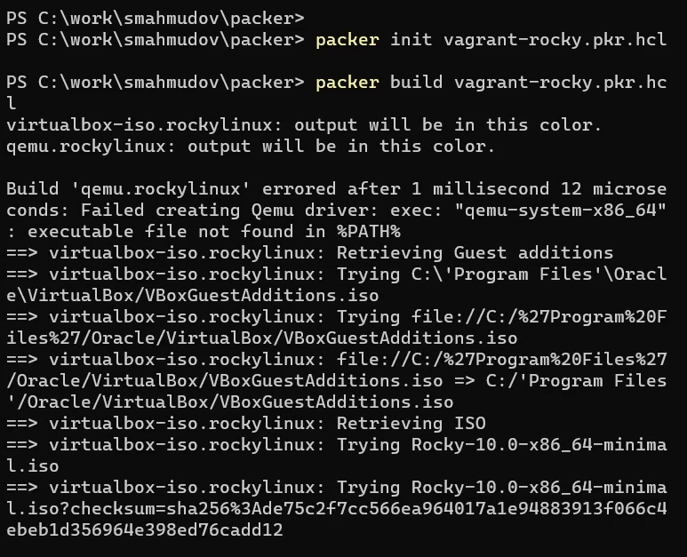
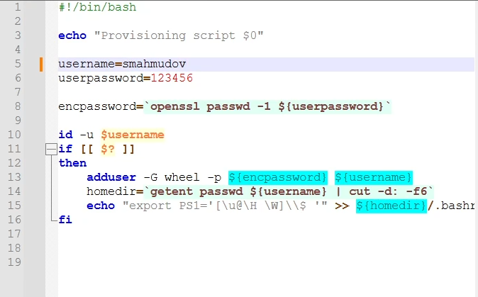
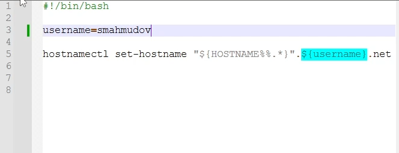
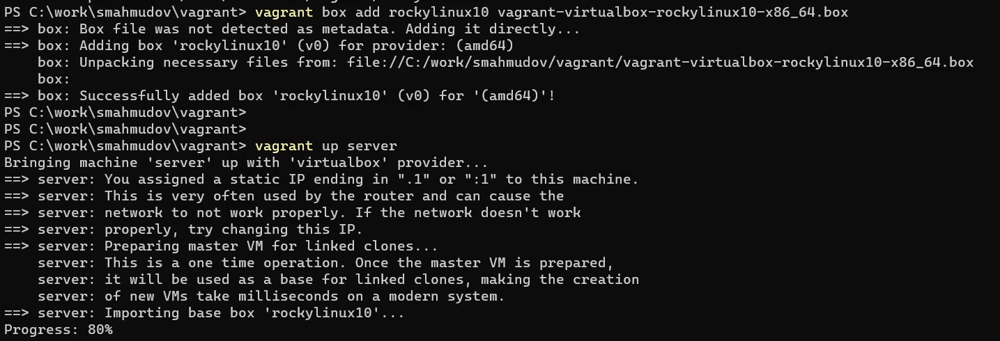
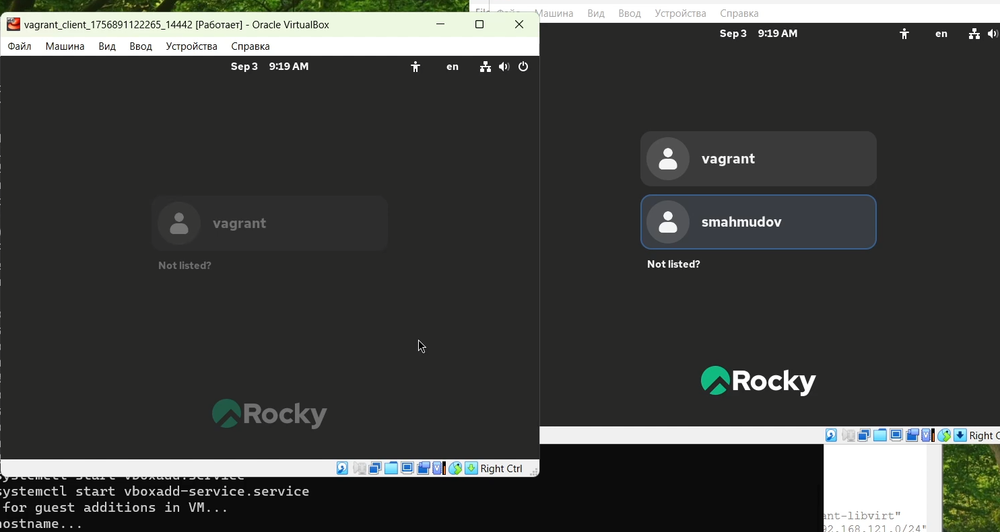
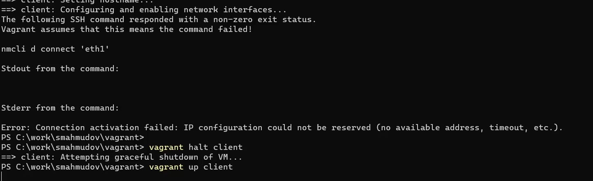
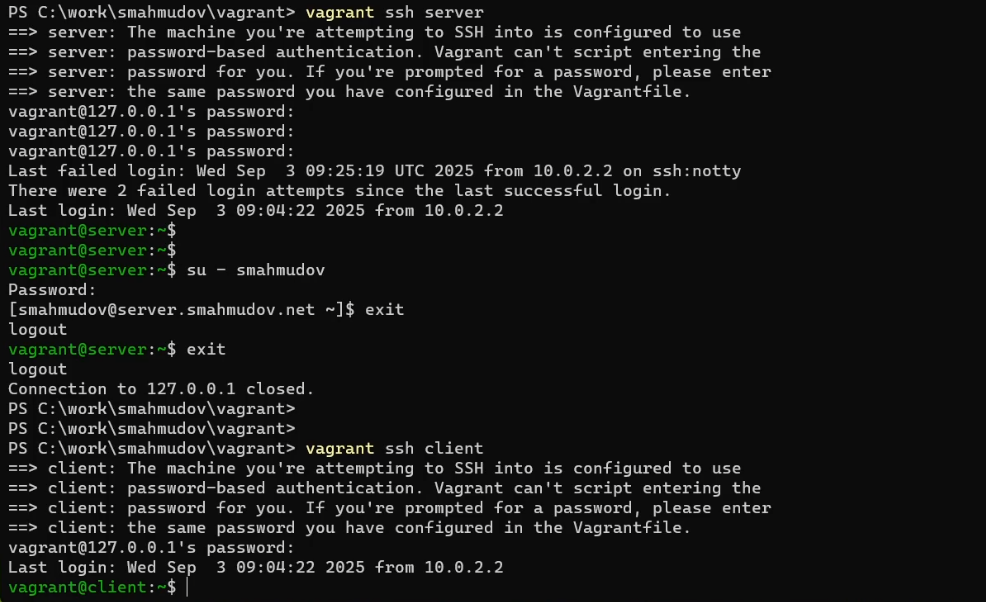

---
## Front matter
title: "Отчёт по лабораторной работе 1"
subtitle: "Подготовка лабораторного стенда с использованием Vagrant"
author: "Суннатилло Махмудов"

## Generic otions
lang: ru-RU
toc-title: "Содержание"

## Bibliography
bibliography: bib/cite.bib
csl: pandoc/csl/gost-r-7-0-5-2008-numeric.csl

## Pdf output format
toc: true # Table of contents
toc-depth: 2
lof: true # List of figures
lot: true # List of tables
fontsize: 12pt
linestretch: 1.5
papersize: a4
documentclass: scrreprt
## I18n polyglossia
polyglossia-lang:
  name: russian
  options:
	- spelling=modern
	- babelshorthands=true
polyglossia-otherlangs:
  name: english
## I18n babel
babel-lang: russian
babel-otherlangs: english
## Fonts
mainfont: IBM Plex Serif
romanfont: IBM Plex Serif
sansfont: IBM Plex Sans
monofont: IBM Plex Mono
mathfont: STIX Two Math
mainfontoptions: Ligatures=Common,Ligatures=TeX,Scale=0.94
romanfontoptions: Ligatures=Common,Ligatures=TeX,Scale=0.94
sansfontoptions: Ligatures=Common,Ligatures=TeX,Scale=MatchLowercase,Scale=0.94
monofontoptions: Scale=MatchLowercase,Scale=0.94,FakeStretch=0.9
mathfontoptions:
## Biblatex
biblatex: true
biblio-style: "gost-numeric"
biblatexoptions:
  - parentracker=true
  - backend=biber
  - hyperref=auto
  - language=auto
  - autolang=other*
  - citestyle=gost-numeric
## Pandoc-crossref LaTeX customization
figureTitle: "Рис."
tableTitle: "Таблица"
listingTitle: "Листинг"
lofTitle: "Список иллюстраций"
lotTitle: "Список таблиц"
lolTitle: "Листинги"
## Misc options
indent: true
header-includes:
  - \usepackage{indentfirst}
  - \usepackage{float} # keep figures where there are in the text
  - \floatplacement{figure}{H} # keep figures where there are in the text
---

# Цель работы

Приобретение практических навыков установки Rocky Linux (версия 10, minimal) на виртуальную машину с помощью инструмента Vagrant.

# Теоретические сведения

**Vagrant** — инструмент для создания и управления средами виртуальных машин. Он автоматизирует процесс установки ОС и настройки необходимого ПО. 

Основные понятия:
- **Provider (провайдер)** — система виртуализации, с которой работает Vagrant (VirtualBox, VMware и др.).
- **Box-файл (Vagrant Box)** — сохранённый образ виртуальной машины с ОС.
- **Vagrantfile** — конфигурационный файл на Ruby с параметрами запуска VM.

Пример базовой конфигурации (см. рис. [1](#fig:001)):
```ruby
Vagrant.configure("2") do |config|
  config.vm.box = "rockylinux10"
  config.vm.hostname = "server"
  config.vm.network "private_network", ip: "192.168.1.1"
end
```

Также используется HCL-файл (для Packer), где указываются метаданные для установки ОС, и скрипты **provision**, которые автоматически выполняют настройку окружения (создание пользователя, изменение hostname, настройка маршрутизации и т.д.).

Основные команды Vagrant:

- `vagrant init` — создание Vagrantfile;

- `vagrant up` — запуск VM;

- `vagrant halt` — остановка VM;

- `vagrant reload` — перезапуск VM;

- `vagrant destroy` — удаление VM;

- `vagrant ssh` — подключение к VM.

# Выполнение лабораторной работы

1. Создан каталог для проекта и размещены необходимые файлы:

   - `vagrant-rocky.pkr.hcl` — описание метаданных для установки ОС;

   - `ks.cfg` — файл автоматической установки (язык, клавиатура, сеть, пользователи);

   - `Vagrantfile` — конфигурация серверной и клиентской VM;

   - `Makefile` — упрощённый запуск команд Vagrant.

2. Подготовлен box-файл с дистрибутивом **Rocky Linux 10 minimal**:

   ```bash
   packer init vagrant-rocky.pkr.hcl
   packer build vagrant-rocky.pkr.hcl
   ```

   { #fig:001 width=80% }

3. Внесены изменения в скрипты `01-user.sh` и `01-hostname.sh`, где добавлен пользователь **smahmudov** и скорректировано имя хоста (см. рис. [2](#fig:002), [3](#fig:003)).
   
   { #fig:002 width=70% }
   
   { #fig:003 width=70% }

4. Box-файл зарегистрирован в Vagrant:

   ```bash
   vagrant box add rockylinux10 vagrant-virtualbox-rockylinux10-x86_64.box
   ```

   { #fig:004 width=80% }

5. Запущены виртуальные машины server и client:

   ```bash
   vagrant up server
   vagrant up client
   ```

   { #fig:005 width=80% }

6. Проверена работа системы входа: доступны пользователи *vagrant* и *smahmudov* (см. рис. [6](#fig:006)).
   
   { #fig:006 width=80% }

7. При первом запуске клиента возникла ошибка при настройке сети (см. рис. [7](#fig:007)). Она связана с отсутствием настроенного DHCP-сервера на стороне **server**. Как отметил преподаватель Дмитрий Сергеевич Кулябов в видеозаписи, до выполнения лабораторной работы по настройке DHCP клиент работать не будет.
   
   { #fig:007 width=80% }

8. Проверено подключение по SSH и корректная работа созданного пользователя:

   ```bash
   vagrant ssh server
   su - smahmudov
   ```

   { #fig:008 width=80% }

# Вывод

В ходе лабораторной работы был подготовлен лабораторный стенд с использованием Vagrant. Получены навыки установки Rocky Linux 10 minimal в VirtualBox, конфигурации серверной и клиентской VM, настройки пользователя и сетевых параметров. Выявлена особенность: клиентская машина не получает IP без настройки DHCP на сервере (что будет выполнено в последующих лабораторных работах).

# Контрольные вопросы

1. **Для чего предназначен Vagrant?**  
   Для автоматизации развёртывания и управления виртуальными машинами.

2. **Что такое box-файл? В чём назначение Vagrantfile?**  
   Box-файл — готовый образ VM. Vagrantfile — файл конфигурации для запуска и настройки VM.

3. **Приведите описание и примеры вызова основных команд Vagrant.**  
   - `vagrant init` — создание шаблона;
   - `vagrant up` — запуск VM;
   - `vagrant halt` — остановка;
   - `vagrant reload` — перезапуск;
   - `vagrant ssh` — вход в VM.

4. **Дайте построчные пояснения содержания файлов vagrant-rocky.pkr.hcl, ks.cfg, Vagrantfile, Makefile.**  
   - `vagrant-rocky.pkr.hcl` — описание сборки ОС, параметры ISO, плагины, установка пакетов.
   - `ks.cfg` — автоматическая установка (разметка диска, пароль root, сетевые настройки).
   - `Vagrantfile` — определяет сервер и клиент, их IP, ресурсы, provisioning-скрипты.
   - `Makefile` — содержит цели для упрощённого вызова команд Vagrant (запуск, остановка, удаление VM).

# Список литературы

1. GNU Bash Manual. — 2019. — URL: https://www.gnu.org/software/bash/manual/
2. GNU Make Manual. — 2016. — URL: http://www.gnu.org/software/make/manual/
3. Powers S. *Vagrant Simplified* [Просто о Vagrant] / Пер.: А. Панин // rus-linux.net. — 2015. — URL: http://rus-linux.net/MyLDP/vm/vagrant-simplified.html
4. Vagrant Documentation. — URL: https://www.vagrantup.com/docs
5. Купер М. *Искусство программирования на языке сценариев командной оболочки*. — 2004. — URL: https://www.opennet.ru/docs/RUS/bash_scripting_guide/

